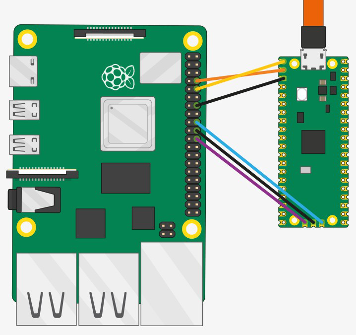

**Entwicklungsumgebung**

Das Setup setzt voraus das ein Rpi als Brücke mit dem pico wie auf dem
Bild unten verbunden ist, und in dessen raspi-config die Loginshell über
die serielle Konsole deativiert und der Hardware-Zugriff aktiviert sind,
und einen Rpi/Linuxrechner im gleichem wlan zum entwickeln. Auf beiden
Rechnern muss der Benutzer ein „/home/user/"-Verzeichniss haben.

> {width="4.2125in"
> height="3.9583333333333335in"}
>
> 1\. **install_bridge.sh**\
> muss aus „/home/user/" **mit** sudo aufgerufen werden!
>
> installiert und konfiguriert auf der Brücke alles nötige und rebootet.
> danach kann vom Entwicklungrechner aus die elf-Datei übertragen und
> die serielle Konsole zum pico geöffnet werden.
>
> 2\. **install_desktop.sh**\
> muss aus „/home/user/" **ohne** sudo aufgerufen werden!
>
> Installiert das pico-c-sdk und legt drei skripte, darunter
> „new_projekt.sh" in „/home/user/pico/" an die von Geany als IDE zur
> Ausführung benötigt werden.
>
> 3\. **new_projekt.sh**\
> Muss in /home/user/pico/ mit dem gewünschten Projektnamen als
> Parameter ausgeführt werden und erstellt ein neues pico-c-sdk-Projekt
> für Geany. Geany öffnet sich danach automatisch und ein
> „Hallo-Welt"-Code kann unmittelbar mit F9 gebuildet, mit shift-F9
> kompiliert und anschließend mit F5 auf den pico übertragen werden. Mit
> dem Geany-Menue„Erstellen→Seriell" wird die serielle Konsole zum pico
> geöffnet um die printf-Anweisung zu sehen.
>
> 4\. **new_lib.sh**\
> Aufruf mit Projektname und Bibliotheksname als Parameter aus
> „/home/user/pico/ heraus.
>
> Erstellt neue Bibliotheken-Grundgerueste in einem bereits vorhandenem
> Projekt\
> Es wird das Unterverzeichniss im Projektverzeichniss erstellt sowie
> die CMakeLists.txt, header und .c datei in diesem erstellt\
> auch wird die CMakeLists.txt und projektname.c-Datei des Projekts
> angepasst so das nur noch die header Datei und die c-Datei der
> Bibliothek bearbeitet werden muessen

**SSH-Konfiguration**

auf dem Entwicklungsrechner ssh-Schluessel erzeugen\--\>\"ssh-keygen -t
rsa\"\
den Schluessel auf den Raspi-Zero übertragen\
\--\>\"ssh-copy-id -i \~/.ssh/id_rsa.pub user@bridge-hostname\"
